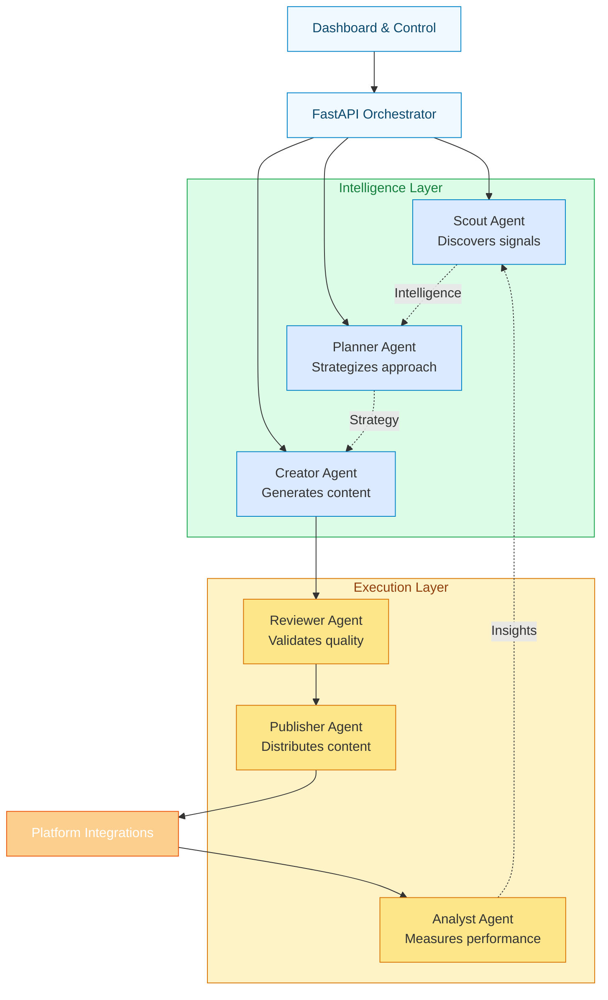
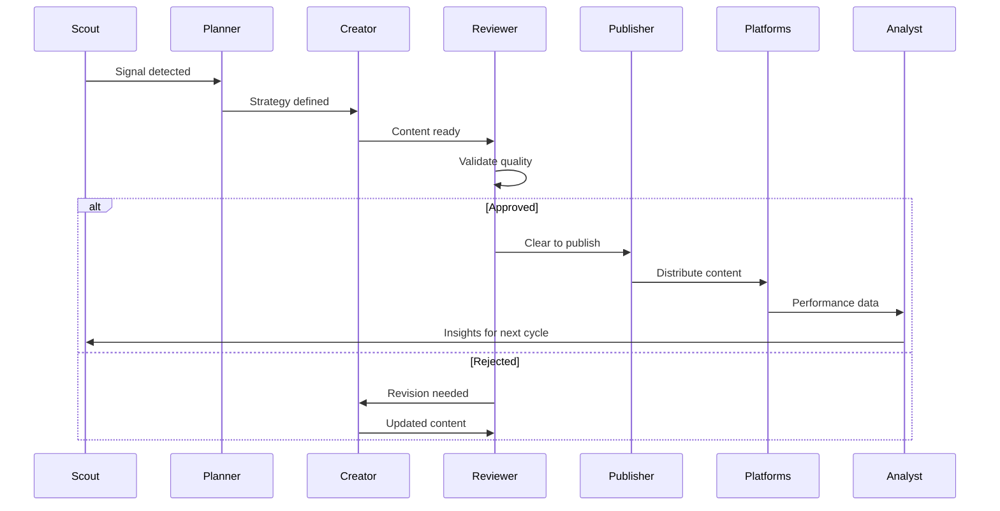
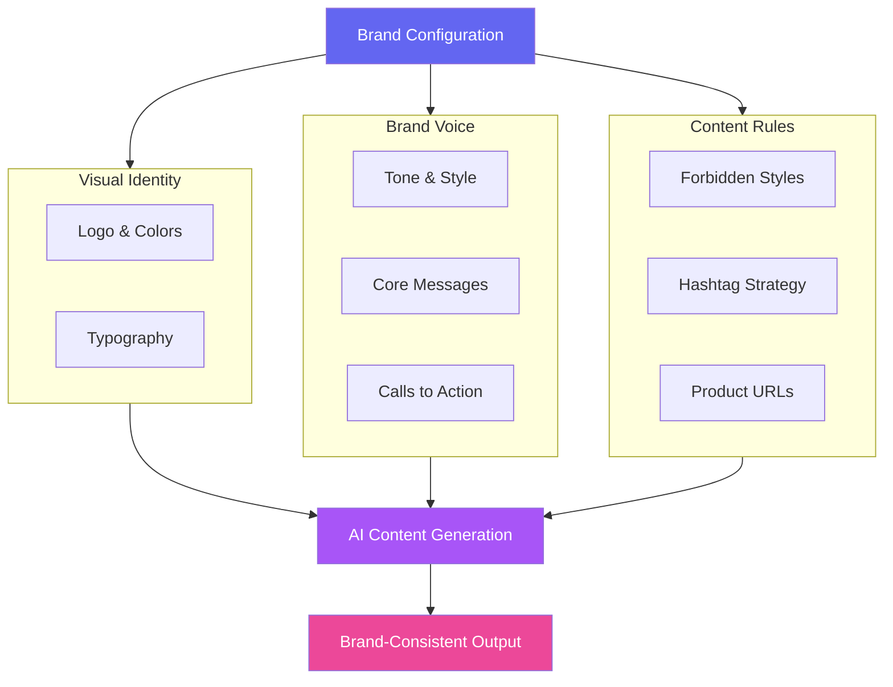
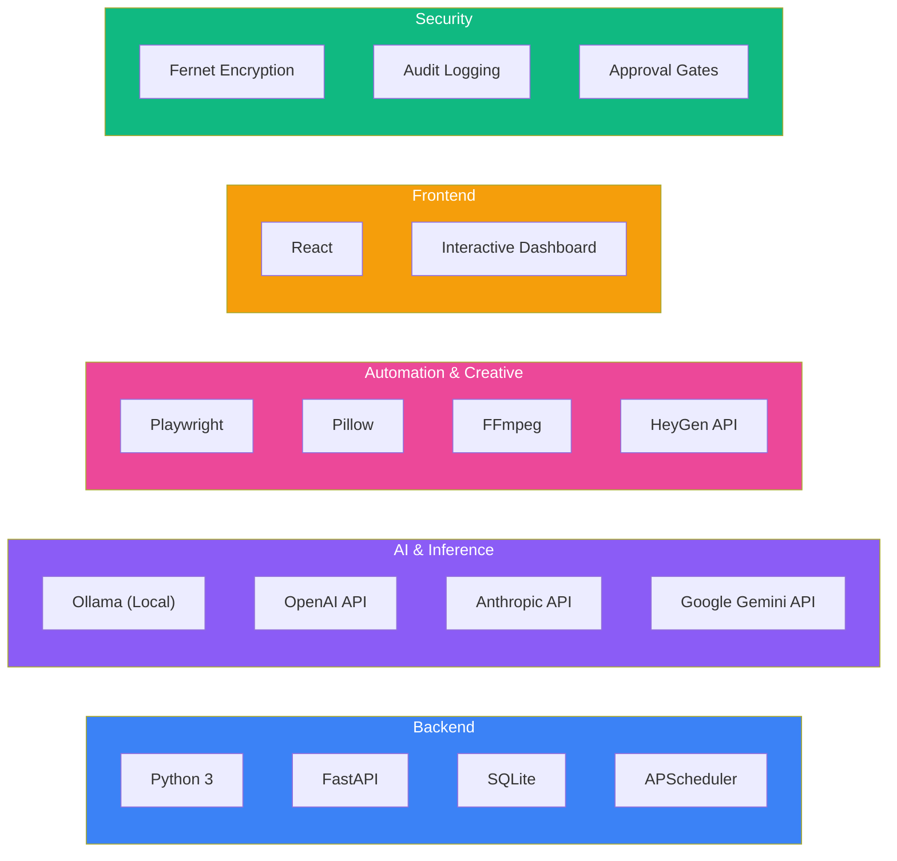
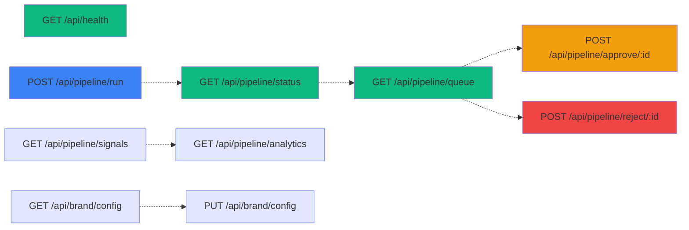
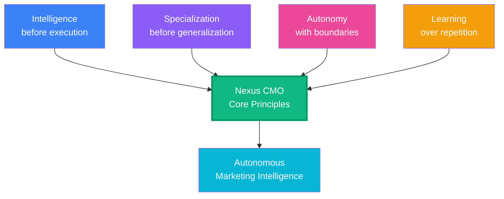
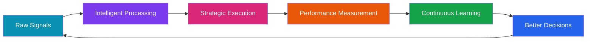

# Nexus CMO

## The Autonomous Marketing Intelligence Layer

> Transform marketing from manual workflows into a continuously improving autonomous system.

---

## Vision

Nexus CMO is not another content generator. It's an **AI-powered Chief Marketing Officer** — a self-hosted, multi-agent system that discovers what matters, decides what to say, creates branded content, validates it, publishes it, and learns from the results.


---

## The Problem Marketing Teams Face

| Traditional Workflow | Nexus CMO |
|---|---|
| Scattered tools for each task | Unified intelligence layer |
| Manual trend discovery | Autonomous signal detection |
| Disconnected approval workflows | Integrated validation gates |
| Repetitive multi-platform publishing | Intelligent distribution |
| Analytics in separate dashboards | Closed-loop performance feedback |

---

## Architecture

Nexus CMO uses a **specialized multi-agent architecture** where each stage of the marketing lifecycle has its own intelligence.



---

## The Six Agents

### Scout
Continuously monitors signals worth acting on:
- AI & technology news
- RSS feeds & Hacker News
- GitHub activity & emerging topics
- Industry trends

### Planner
Evaluates signals and decides:
- What deserves attention
- Which audience to target
- Platform selection
- Content format & timing

### Creator
Transforms strategy into production-ready content:
- Platform-specific adaptations
- Brand-consistent messaging
- Visual asset generation
- Optimized CTAs & hashtags

### Reviewer
Quality & safety validation gate:
- Brand voice consistency
- Claim verification
- Credential protection
- Platform suitability
- Risk assessment

### Publisher
Handles multi-platform distribution:
- LinkedIn, X, Facebook, Instagram
- Discord, Reddit, Medium, Substack
- Email platforms (Brevo, MailerLite)
- Webhook integrations

### Analyst
Closes the intelligence loop:
- Performance tracking
- Insight generation
- Strategy recommendations
- Continuous optimization

---

## The Workflow



---

## Brand Intelligence

Nexus CMO maintains a **Brand Kit** that acts as a shared context layer across all agents:



---

## Technology Stack



---

## Quick Start

### Prerequisites
- Python 3.8+
- pip
- Playwright & Chromium
- Ollama or API keys (OpenAI/Anthropic/Gemini)

### Installation

**1. Clone the repository**
```bash
git clone https://github.com/yourusername/Nexus-CMO.git
cd Nexus-CMO
```

**2. Setup Python environment**
```bash
cd backend
python3 -m venv .venv

# macOS / Linux
source .venv/bin/activate

# Windows
.venv\Scripts\activate
```

**3. Install dependencies**
```bash
pip install -r requirements.txt
playwright install chromium
```

**4. Configure environment**
```bash
cp .env.example .env
```

Edit `.env` with your settings:
```env
# AI Provider
AI_PROVIDER=ollama
OLLAMA_URL=http://127.0.0.1:11434
OLLAMA_MODEL=qwen3:8b

# Alternative: Cloud providers
# OPENAI_API_KEY=sk_...
# ANTHROPIC_API_KEY=sk_ant_...
# GEMINI_API_KEY=...

# Settings
HEADLESS=false
```

**5. Start the system**
```bash
python main.py
```

Dashboard: `http://localhost:8000`  
API Docs: `http://localhost:8000/docs`

---

## Local AI Setup

For completely private operation with **Ollama**:

```bash
# Install and start Ollama
ollama serve

# In another terminal, pull the model
ollama pull qwen3:8b

# Set in .env
AI_PROVIDER=ollama
```

No external API keys, no data leaving your infrastructure.

---

## API Endpoints



**Interactive API Explorer**: Visit `/docs` after starting the server.

---

## Execution Timeline

```mermaid
timeline
    title Daily Nexus CMO Autonomous Execution
    
    section Morning
    08:00 : Scout discovers new signals
         : Planner identifies opportunities
    11:00 : Creator generates content
         : Reviewer validates

    section Afternoon
    14:00 : Scout refreshes intelligence
    
    section Evening
    23:00 : Publisher distributes approved content
    23:30 : Analyst generates insights

    section Next Day
    Loop : Better intelligence to better decisions
```

---

## Project Structure

```
Nexus-CMO/
├── backend/
│   ├── agents/
│   │   ├── scout/          # Signal discovery
│   │   ├── planner/        # Strategy & planning
│   │   ├── creator/        # Content generation
│   │   ├── reviewer/       # Quality validation
│   │   ├── publisher/      # Distribution
│   │   └── analyst/        # Performance tracking
│   │
│   ├── api/                # FastAPI routes
│   ├── services/           # Business logic
│   ├── integrations/       # Platform APIs
│   ├── models/             # Data models
│   └── main.py             # Entry point
│
├── frontend/
│   └── dashboard/          # React UI
│
├── configs/
│   └── brand.yaml          # Brand configuration
│
├── .env.example            # Environment template
├── requirements.txt        # Python dependencies
└── README.md
```

---

## Security by Design

- **Credential Protection** — Platform credentials encrypted & stored locally  
- **Approval Gates** — Content validated before publication  
- **Claim Validation** — Problematic claims flagged automatically  
- **Local-First** — Sensitive data remains on your infrastructure  
- **Audit Logging** — All actions tracked for compliance  

**Philosophy**: *Let AI move fast. Keep the system accountable.*

---

## Roadmap

### Intelligence Expansion
- Deeper competitor analysis
- Market opportunity detection
- Predictive content performance
- Share-of-voice tracking

### New Agents
- SEO Agent
- Community Agent
- Outreach Agent
- Campaign Agent
- Growth Agent

### Enhanced Execution
- Campaign-level orchestration
- Automated A/B testing
- Adaptive publishing schedules
- Cross-platform synchronization

### Advanced Analytics
- Attribution modeling
- Audience segmentation
- Content performance prediction
- Automated strategy recommendations

---

## Design Philosophy



---

## Contributors

### Lakshya Dogra
**AI & Backend Architecture**

Responsible for the technical foundation and intelligent orchestration:
- Backend system design and FastAPI implementation
- Multi-agent architecture and orchestration
- AI provider integrations (Ollama, OpenAI, Anthropic, Google Gemini)
- Agent prompt engineering and performance optimization
- Pipeline testing and deployment strategy

### Vishesh Nigam
**Frontend & Product Experience**

Responsible for the user-facing platform and design execution:
- Interactive dashboard development and UI/UX
- Visual design and brand identity implementation
- Agent visualization and monitoring interface
- Animations and interactive components
- Frontend integration with backend APIs

---

## Built for Hackathon

Nexus CMO represents a fundamental shift in how AI can approach marketing:

**Not**: "How can AI help marketers?"  
**But**: "What if marketing itself could be autonomous?"

From the first signal to the final performance insight, every component is connected in a self-improving loop.



---

## License

MIT License — See LICENSE file for details.

---

## Acknowledgements

Nexus CMO builds upon the open-source **SocialFlow** foundation, extending its autonomous social-media architecture into a more polished, **AI Chief Marketing Officer experience** optimized for the hackathon.

---

<div align="center">

### From Marketing Tools to Marketing Intelligence

Discover • Decide • Create • Review • Publish • Learn

[Get Started](#quick-start) • [API Docs](#api-endpoints) • [Roadmap](#roadmap)

---

Built for autonomous marketing intelligence

</div>
