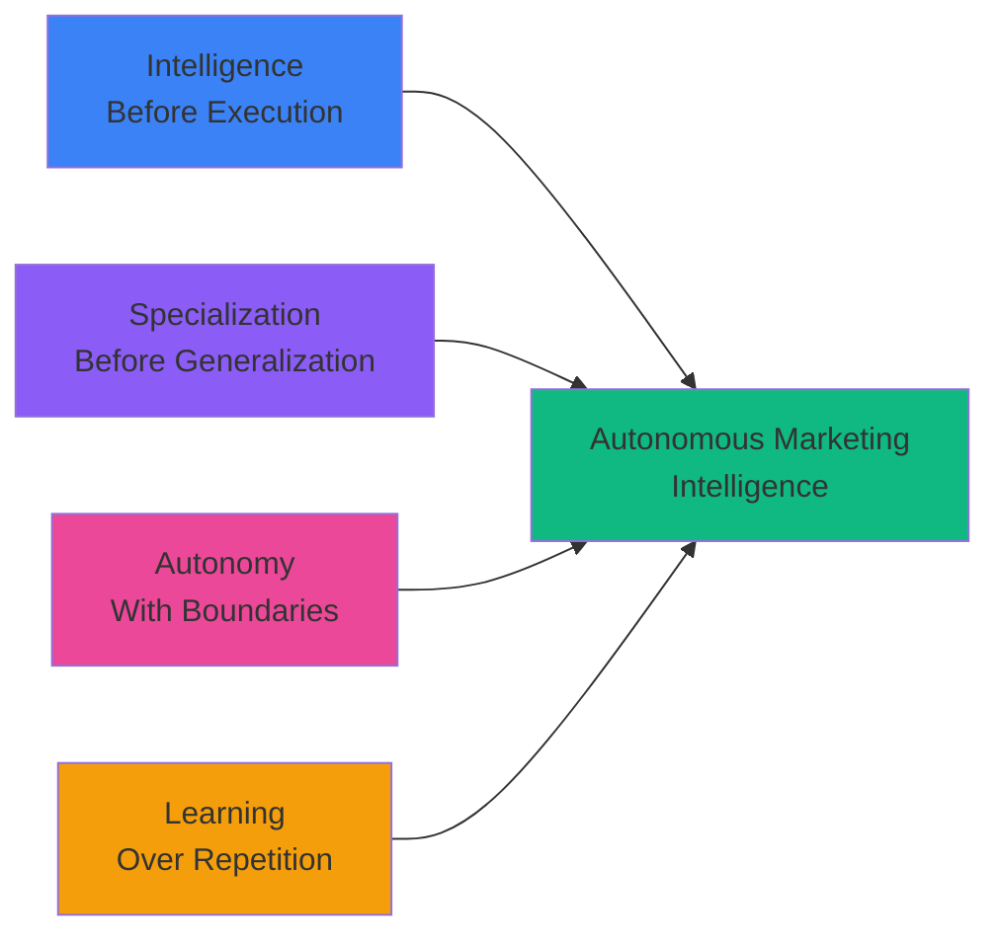

# Nexus CMO 

## The Autonomous Marketing Intelligence Layer

> Transform marketing from manual workflows into a continuously improving autonomous system.

---

## Vision

Nexus CMO is not another content generator. It's an **AI-powered Chief Marketing Officer** — a self-hosted, multi-agent system that discovers what matters, decides what to say, creates branded content, validates it, publishes it, and learns from the results.

### The Nexus Loop

```
┌───────────┐     ┌───────────┐     ┌───────────┐
│  DISCOVER │ ──► │   DECIDE  │ ──► │   CREATE  │
│   Scout   │     │  Planner  │     │  Creator  │
└───────────┘     └───────────┘     └─────┬─────┘
                                          │
                                          ▼
┌───────────┐     ┌───────────┐     ┌───────────┐
│   LEARN   │ ◄── │  PUBLISH  │ ◄── │   REVIEW  │
│  Analyst  │     │ Publisher │     │  Reviewer │
└─────┬─────┘     └───────────┘     └───────────┘
      │
      │        Continuous Intelligence
      └──────────────────────────────────────► DISCOVER
```

From signal to insight, every component is connected in a self-improving loop.

---

## The Problem Marketing Teams Face

| Traditional Workflow | Nexus CMO |
|---|---|
| Scattered tools for each task | Unified intelligence layer |
| Manual trend discovery | Autonomous signal detection |
| Disconnected approval workflows | Integrated validation gates |
| Repetitive multi-platform publishing | Intelligent distribution |
| Analytics in separate dashboards | Closed-loop performance feedback |

---

## Architecture

Nexus CMO is built around a specialized multi-agent architecture where every stage of the marketing lifecycle has a defined responsibility.

```mermaid
flowchart TD
    Dashboard["Dashboard"]
    API["FastAPI Orchestrator"]
    Scout["Scout<br/>Intelligence"]
    Planner["Planner<br/>Strategy"]
    Creator["Creator<br/>Content"]
    Reviewer["Reviewer<br/>Validation"]
    Publisher["Publisher<br/>Distribution"]
    Analyst["Analyst<br/>Learning"]
    
    Dashboard --> API
    API --> Scout
    API --> Planner
    API --> Creator
    Scout --> Planner
    Planner --> Creator
    Creator --> Reviewer
    Reviewer --> Publisher
    Publisher --> Analyst
    Analyst -.-> Scout
    
    style Dashboard fill:#1f2937
    style API fill:#374151
    style Scout fill:#1e40af
    style Planner fill:#1e40af
    style Creator fill:#1e40af
    style Reviewer fill:#f59e0b
    style Publisher fill:#f59e0b
    style Analyst fill:#16a34a
```



---

## The Six Agents

| Agent | Role | Core Responsibility |
|---|---|---|
| **Scout** | Intelligence | Discovers trends, news, GitHub activity and emerging signals |
| **Planner** | Strategy | Determines audience, platform, format and timing |
| **Creator** | Production | Generates platform-specific branded content and visuals |
| **Reviewer** | Governance | Validates quality, claims, brand voice and publishing risks |
| **Publisher** | Execution | Distributes approved content across connected platforms |
| **Analyst** | Learning | Measures performance and feeds insights into the next cycle |

---

## The Workflow

**Step 1: Signal Detection**  
Scout continuously monitors signals and identifies marketing opportunities.

**Step 2: Strategy Definition**  
Planner evaluates signals and determines what to say, where, when, and to whom.

**Step 3: Content Generation**  
Creator produces platform-specific content while maintaining brand consistency.

**Step 4: Quality Validation**  
Reviewer validates content for quality, claims, brand voice and safety.

**Step 5: Approval Decision**
- **Approved**: Content moves to Publisher
- **Rejected**: Content returns to Creator with revision notes

**Step 6: Distribution**  
Publisher distributes approved content across all connected platforms.

**Step 7: Performance Tracking**  
Analyst monitors engagement, reach and performance metrics.

**Step 8: Learning Loop**  
Insights are fed back to Scout for smarter future decisions.

---

## Brand Intelligence

Nexus CMO maintains a **Brand Kit** that acts as a shared context layer across all agents. This ensures every piece of content—whether written or visual—reflects your brand identity.

### Brand Kit Components

| Category | Elements |
|---|---|
| **Visual Identity** | Logo, primary colors, secondary colors, typography system |
| **Brand Voice** | Tone, writing style, core messaging, calls-to-action |
| **Content Rules** | Forbidden styles, hashtag strategy, product URLs, platform preferences |

All agents reference the Brand Kit during decision-making and content creation, ensuring consistency across every platform and format.

---

## Technology Stack

### Backend & Orchestration
- **Python 3** — Core language
- **FastAPI** — API and orchestration layer
- **SQLite** — Local data storage
- **APScheduler** — Autonomous task scheduling

### AI & Inference
- **Ollama** — Local LLM hosting
- **OpenAI** — GPT-4 and text models
- **Anthropic** — Claude API integration
- **Google Gemini** — Gemini API support

### Automation & Creative
- **Playwright** — Browser automation for publishing
- **Pillow** — Image processing and generation
- **FFmpeg** — Video and media handling
- **HeyGen** — Video content creation API

### Frontend
- **React** — Interactive dashboard
- **HTML/CSS** — UI design and layout

### Security
- **Fernet Encryption** — Credential protection
- **Audit Logging** — Action tracking and compliance
- **Approval Gates** — Content validation before publication

---

## Quick Start

### Prerequisites
- Python 3.8+
- pip
- Playwright & Chromium
- Ollama or API keys (OpenAI/Anthropic/Gemini)

### Installation

**1. Clone the repository**
```bash
git clone https://github.com/lakshya0101/Nexus-CMO.git
cd Nexus-CMO
```

**2. Setup Python environment**
```bash
cd backend
python3 -m venv .venv

# macOS / Linux
source .venv/bin/activate

# Windows
.venv\Scripts\activate
```

**3. Install dependencies**
```bash
pip install -r requirements.txt
playwright install chromium
```

**4. Configure environment**
```bash
cp .env.example .env
```

Edit `.env` with your settings:
```env
# AI Provider
AI_PROVIDER=ollama
OLLAMA_URL=http://127.0.0.1:11434
OLLAMA_MODEL=qwen3:8b

# Alternative: Cloud providers
# OPENAI_API_KEY=sk_...
# ANTHROPIC_API_KEY=sk_ant_...
# GEMINI_API_KEY=...

# Settings
HEADLESS=false
```

**5. Start the system**
```bash
python main.py
```

Dashboard: `http://localhost:8000`  
API Docs: `http://localhost:8000/docs`

---

## Local AI Setup

For completely private operation with **Ollama**:

```bash
# Install and start Ollama
ollama serve

# In another terminal, pull the model
ollama pull qwen3:8b

# Set in .env
AI_PROVIDER=ollama
```

No external API keys, no data leaving your infrastructure.

---

## API Endpoints

| Endpoint | Method | Purpose |
|---|---|---|
| `/api/health` | GET | Health check and system status |
| `/api/pipeline/run` | POST | Trigger the autonomous pipeline manually |
| `/api/pipeline/status` | GET | View current pipeline state |
| `/api/pipeline/queue` | GET | View content approval queue |
| `/api/pipeline/approve/{id}` | POST | Approve queued content |
| `/api/pipeline/reject/{id}` | POST | Reject and return content for revision |
| `/api/pipeline/publish/{id}` | POST | Publish approved content |
| `/api/pipeline/signals` | GET | Retrieve discovered intelligence signals |
| `/api/pipeline/analytics` | GET | Retrieve performance analytics and insights |
| `/api/brand/config` | GET/PUT | Manage brand configuration |
| `/api/accounts` | GET/POST | Manage platform account integrations |
| `/api/posts` | GET/POST | Manage published posts and content |
| `/docs` | GET | Interactive API documentation (Swagger UI) |

**Interactive API Explorer**: Visit `/docs` after starting the server.

---

## Execution Timeline

### Daily Autonomous Marketing Cycle

| Time | Agent | Action |
|---|---|---|
| **08:00** | Scout | Discovers new signals and emerging opportunities |
| **08:00** | Planner | Evaluates signals and identifies strategic opportunities |
| **11:00** | Creator | Generates platform-specific branded content |
| **11:00** | Reviewer | Validates content quality, claims and brand rules |
| **14:00** | Scout | Refreshes intelligence and discovers new signals |
| **23:00** | Publisher | Distributes approved content across platforms |
| **23:30** | Analyst | Generates performance insights and recommendations |
| **Next Cycle** | Nexus CMO | Feeds insights back into the intelligence loop |

---

## Project Structure

```
Nexus-CMO/
├── backend/
│   ├── agents/
│   │   ├── scout/          # Signal discovery
│   │   ├── planner/        # Strategy & planning
│   │   ├── creator/        # Content generation
│   │   ├── reviewer/       # Quality validation
│   │   ├── publisher/      # Distribution
│   │   └── analyst/        # Performance tracking
│   │
│   ├── api/                # FastAPI routes
│   ├── services/           # Business logic
│   ├── integrations/       # Platform APIs
│   ├── models/             # Data models
│   └── main.py             # Entry point
│
├── frontend/
│   └── dashboard/          # React UI
│
├── configs/
│   └── brand.yaml          # Brand configuration
│
├── .env.example            # Environment template
├── requirements.txt        # Python dependencies
└── README.md
```

---

## Security by Design

- **Credential Protection** — Platform credentials encrypted & stored locally  
- **Approval Gates** — Content validated before publication  
- **Claim Validation** — Problematic claims flagged automatically  
- **Local-First** — Sensitive data remains on your infrastructure  
- **Audit Logging** — All actions tracked for compliance  

**Philosophy**: *Let AI move fast. Keep the system accountable.*

---

## Roadmap

### Intelligence Expansion
- Deeper competitor analysis
- Market opportunity detection
- Predictive content performance
- Share-of-voice tracking

### New Agents
- SEO Agent
- Community Agent
- Outreach Agent
- Campaign Agent
- Growth Agent

### Enhanced Execution
- Campaign-level orchestration
- Automated A/B testing
- Adaptive publishing schedules
- Cross-platform synchronization

### Advanced Analytics
- Attribution modeling
- Audience segmentation
- Content performance prediction
- Automated strategy recommendations

---

## Design Philosophy

Nexus CMO follows four core principles that define its approach to autonomous marketing.



These principles combine to create a system that executes marketing workflows while remaining accountable and controllable.

---

## Contributors

### Lakshya Dogra
**AI & Backend Architecture**

Responsible for the technical foundation and intelligent orchestration:
- Backend system design and FastAPI implementation
- Multi-agent architecture and orchestration
- AI provider integrations (Ollama, OpenAI, Anthropic, Google Gemini)
- Agent prompt engineering and performance optimization
- Pipeline testing and deployment strategy

### Vishesh Nigam
**Frontend & Product Experience**

Responsible for the user-facing platform and design execution:
- Interactive dashboard development and UI/UX
- Visual design and brand identity implementation
- Agent visualization and monitoring interface
- Animations and interactive components
- Frontend integration with backend APIs

---

## Built for Hackathon

Nexus CMO represents a fundamental shift in how AI can approach marketing:

**Not**: "How can AI help marketers?"  
**But**: "What if marketing itself could be autonomous?"

From the first signal to the final performance insight, every component is connected in a self-improving loop.

```text
┌──────────────┐
│ Raw Signals  │
└──────┬───────┘
       │
       ▼
┌──────────────────────┐
│ Intelligent          │
│ Processing           │
└──────┬───────────────┘
       │
       ▼
┌──────────────────────┐
│ Strategic            │
│ Execution            │
└──────┬───────────────┘
       │
       ▼
┌──────────────────────┐
│ Performance          │
│ Measurement          │
└──────┬───────────────┘
       │
       ▼
┌──────────────────────┐
│ Continuous           │
│ Learning             │
└──────┬───────────────┘
       │
       ▼
┌──────────────────────┐
│ Better               │
│ Decisions            │
└──────┬───────────────┘
       │
       └────────────────→ REPEAT
```

---

## License

MIT License — See LICENSE file for details.

---

## Acknowledgements

Nexus CMO builds upon the open-source **SocialFlow** foundation, extending its autonomous social-media architecture into a more polished, **AI Chief Marketing Officer experience** optimized for the hackathon.

---

<div align="center">

### From Marketing Tools to Marketing Intelligence

Discover • Decide • Create • Review • Publish • Learn

[Get Started](#quick-start) • [API Docs](#api-endpoints) • [Roadmap](#roadmap)

---

Built for autonomous marketing intelligence

</div>
